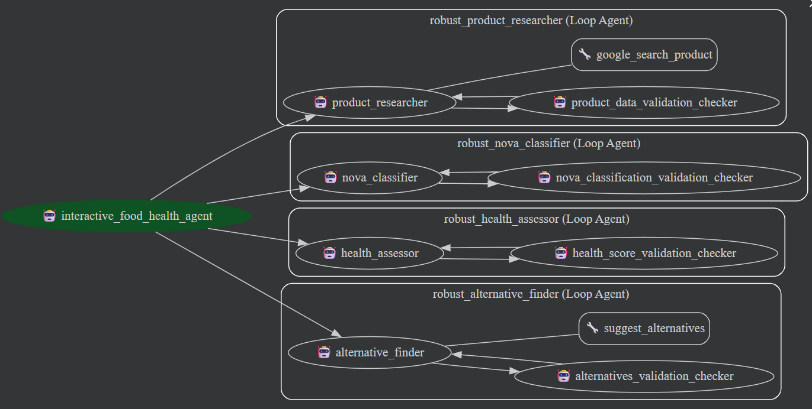

# Food Product Health Agent

This project implements a multi-agent system for analyzing food products using the Google Agent Development Kit (ADK). The system automatically retrieves product information, classifies products according to NOVA processing levels, computes a health score, and suggests healthier alternatives.

---

## Project Overview

Consumers often struggle to understand the nutritional quality and health implications of food products. Manual research is time-consuming, inconsistent, and difficult to scale when comparing multiple products or exploring ingredients in depth.

The Food Product Health Agent automates this workflow. It combines a Wikipedia-filtered Google Search tool with specialized sub-agents to provide structured, actionable insights on food products.



---

## Agent Architecture

The **interactive_food_health_agent** orchestrates all sub-agents and tools. Its workflow is fully automated, requiring user input only at the beginning (product name) and at the end (presenting results).

### Sub-Agents

**1. Product Researcher: `robust_product_researcher`**

* Looks up detailed product information via the Wikipedia-filtered Google Search tool.
* Stores the raw structured data in `product_data`.
* Retries automatically if data is incomplete.

**2. NOVA Classifier: `robust_nova_classifier`**

* Assigns a NOVA processing group and provides reasoning.
* Stores results in `nova_classification`.

**3. Health Assessor: `robust_health_assessor`**

* Computes health score and nutrient breakdown.
* Stores results in `health_score`.

**4. Alternative Finder: `robust_alternative_finder`**

* Suggests healthier alternatives with explanations.
* Stores results in `alternatives`.

### Tools

**Google Search Tool (`google_search_tool`)**

* Callable function returning structured search results.
* Filters out Wikipedia results automatically.
* Used by `robust_product_researcher` to retrieve product information.

---

## Workflow

1. **User Input:** Enter a product name.
2. **Product Lookup:** `robust_product_researcher` retrieves product data.
3. **NOVA Classification:** `robust_nova_classifier` assigns processing group.
4. **Health Assessment:** `robust_health_assessor` calculates health score and nutrient details.
5. **Alternative Suggestions:** `robust_alternative_finder` provides healthier substitutes.
6. **Presentation:** All results are aggregated and presented in structured format.

The agent runs each sub-agent automatically and stores results in the agent state; formatting and display happen at the end.

---

## Installation

1. Clone the repository:

```bash
git clone https://github.com/JamesB112/Food_Product_Agent.git
cd Food_Product_Agent
```

2. Create a virtual environment and activate it:

```bash
python -m venv venv
# Windows
venv\Scripts\activate
# macOS/Linux
source venv/bin/activate
```

3. Install dependencies:

```bash
pip install -r requirements.txt
```

---

## Usage

### Running the Agent in Python

```python
from PRODUCT_AGENT.agent import interactive_food_health_agent

result_state = interactive_food_health_agent.run({"user_input": "Nutella"})
print(result_state)
```

### Running the Streamlit App

```bash
streamlit run streamlit_app.py
```

* Enter a product name
* Click **Analyze Product**
* View structured results: product info, NOVA classification, health score, and alternatives

---

## Repository Structure

```
Food_Product_Agent/
├─ PRODUCT_AGENT/
│   ├─ __init__.py
│   ├─ agent.py                  # Main agent orchestration
│   ├─ sub_agents.py             # Sub-agent definitions
├─ tools/
│   └─ google_search_tool.py     # Wikipedia-filtered Google Search tool
├─ streamlit_app.py              # Interactive testing interface
├─ config.py                     # Model configuration and parameters
├─ agent_util.py                 # Utility functions for agents
├─ validation_checkers.py        # Custom validation checkers for agent outputs
├─ requirements.txt              # Dependencies
├─ flowchart.png                 # Optional architecture diagram
```

---

## License

```
Copyright 2025 Google LLC
Licensed under the Apache License, Version 2.0
http://www.apache.org/licenses/LICENSE-2.0
```
